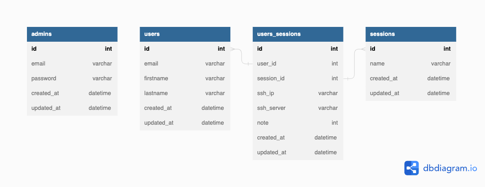

# Express TS API

## Documentation

### Requirements

To install the project, you need to have [Docker](https://www.docker.com/) and [Docker Compose](https://docs.docker.com/compose/) installed on your machine.

To run the project, you need to have [NodeJS](https://nodejs.org/en/) installed on your machine, with the version `18.x.x` or higher.

### Commands

#### Install

This command will install the project and all its dependencies for the API and the frontend.

It will also create a `.env` file for the database, based on the `.env` file in the `api` folder.

At the end of the installation, it will create the docker containers for the database, the API and the frontend.

```bash
make install
```

#### Start

This command will run the docker containers for the database, the API and the frontend.

```bash
make start
```

#### Stop

This command will stop the docker containers for the database, the API and the frontend.

```bash
make stop
```

#### Restart

This command will restart the docker containers for the database, the API and the frontend.

```bash
make restart
```

#### Purify

This command will delete everything related to the project, to start again with a purify project.

```bash
make purify
```

#### Deploy

This command will deploy the project on the server.

```bash
make deploy
```

### Other documentation

- [API](api/README.md)
- [Frontend](frontend/README.md)

## Structure

### API

The API is built with [Express](https://expressjs.com/) and [TypeScript](https://www.typescriptlang.org/).

The API structure is the following:

```bash
api
├── src
│   ├── config
│   ├── controllers
│   ├── database
│   ├── middlewares
│   ├── models
│   ├── routes
│   ├── services
│   ├── types
│   ├── utils
```

> Specific documentation for the API can be found [here](api/README.md).

### Database

The database is a [MariaDB](https://mariadb.org/) database and we are using [Sequelize](https://sequelize.org/) as an ORM.

The database diagram is the following:



### Frontend

The frontend is built with [Nuxt](https://nuxt.com/) and [TypeScript](https://www.typescriptlang.org/).

The frontend structure is the following:

```bash
frontend
├── src
│   ├── assets
│   ├── components
│   ├── layouts
│   ├── pages
│   ├── plugins
│   ├── public
│   ├── services
│   ├── store
│   ├── types
```

> Specific documentation for the frontend can be found [here](frontend/README.md).

## Workflow

### Connection to the admin panel

To connect to the admin panel, you need to go to the `/admin` route.
You will be asked to enter a email and a password.

### Create a session

Once you are connected to the admin panel, you can create a session by clicking on the `Create a session` button.

You will be asked to enter a name for the session and a duration for the session.

Once you have created the session, you will have a link to the session. You can copy this link and send it to the participants.

### Join a session

To join a session, you need to go to the link that the admin sent you.
You will be asked to enter a name and an email.

Once you have entered your name and email, you will receive an email with a magic link to join the session.

### Do the exercises

Once the session has started, the participants will see the exercises that they need to do, one by one.

### Test the exercises

Once the participants have done the exercises, they can test them by clicking on the `Test` button.

They will see the result of the test and the admin will see the result of the test in the admin panel.
Which will display the notes of the participants.

### End a session

The admin can end the session at any time by clicking on the `End session` button.

### Admin panel

The admin panel is a dashboard that displays the participants connected to the session and the exercises that they have done. It also displays the notes of the participants.

The admin can also end the session at any time.

## Improvements

- [ ] Add unit tests for the API
- [ ] Add end-to-end tests for the frontend
- [ ] Add a search bar for the admin panel
- [ ] Add differents exercices that the admin can choose by creating a new session
- [ ] Add a timer for the session to stop when the timer expires
- [ ] Add a way to control who is connected to the session and block the access to the session if the user is not in the list

And many more...

---

[Sami Lafrance](https://www.samilafrance.com/) | [Paul Cotogno](https://paulcotogno.com/) | [Etienne Moureton](https://www.etiennemoureton.fr/) | [Pierre Keller](https://pierrekeller.com/)
